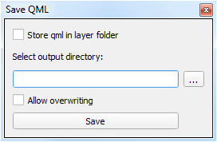

================================
QGIS plugin for saving QML files
================================

**Save QML** plugin saves *QML* file for each layer in current project. It allows us to choose whether we want to save *QML* files into layer directory or to a directory by our choice.
It also gives us the choice whether we want to overwrite existing *QML* file or not.

.. note:: This plugin was made for QGIS 3.

Installation
============

The installation is performed via *Manage and Install Plugins...*

In this window in ``Settings`` is necessary to check **Show also experimental plugins**.

After this you just choose **Save QML** plugin and click on ``Install plugin`` .

If installation went well, new icon appears in QGIS:

Manual
======

Plugin appearance
-----------------

Choosing output directory
-------------------------

The user has two options for output directory: to save *QML* files into layer directory or to a directory by own choice.
If the first option is choosen, the user just checks the ``Store qml in layer folder`` checkbox.

If the second option is choosen, the user chooses output directory via tool button ``...`` .

.. image:: images/output_dir_2.png

Overwrite or not
----------------

The user may further decide whether overwrite already existing *QML* files or not.
For this purpose there is a ``Allow overwriting`` checkbox.

.. image:: images/overwrite.png

Saving
------

The saving of *QML* files is performed via ``Save`` button.